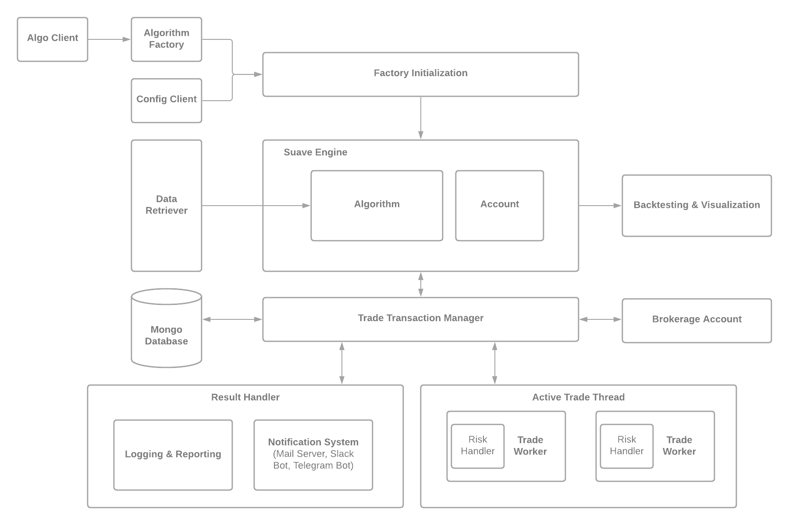

## Introduction ## 
Suave is an algorithmic trading engine built to support easy strategy research, backtesting, and live trading. 
## System Overview ## 

The Suave Engine is built using modular pieces which handle functionality such as trade execution, backtesting & visualization, as well as data retrieval. The Suave Engine is set up by passing in a config client that contains the information needed to commence trading.

The most important pieces are:
  - **Trade Transaction Manager**
    > Handle all incoming trade notifications from the algorithm pipeline. Updates result handler, trade thread, and database with new quotes, parameters, and    orders. Interfaces with brokerage API to execute live trades. Will communicate with the central Suave Engine to update transaction details. 
  - **Active Trade Thread**
    > Contains "trade workers" that concurrently monitors trades for various technical factors. Interfaces with the trade transaction manager to execute trades when certain indicators are met. 
  - **Data Retriever**
    > Connect and retrieve the data necessary for the algorithmic trading engine. Suave Engine uses the Alpha Vantage API to stream live data. 
  - **Factory Initialization**
    > Intializes the algorithms, data, and portfolio/account information to start trading. Variables used for this initialization process is passed through using a configuration client. 
    
